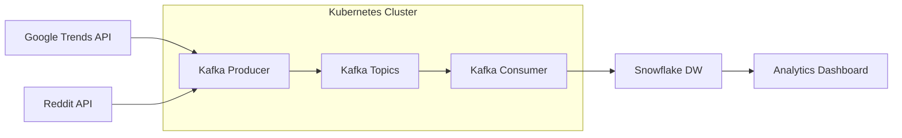

# 📺 Streaming Platform Intelligence Pipeline

> **Real-time data pipeline analyzing streaming platform competition, consumer behavior, and subscription economics**

[](https://python.org)
[](https://kafka.apache.org)
[](https://kubernetes.io)
[](https://snowflake.com)
[](https://streamlit.io)

## 🎯 Business Problem

Streaming platforms are hemorrhaging money due to subscription churn, pricing confusion, and content gaps. This pipeline provides **real-time competitive intelligence** by analyzing:

- **Platform switching behavior** and subscription economics
- **Content availability gaps** that drive alternative viewing 
- **Pricing elasticity** and consumer sentiment
- **"Cord-cutting" patterns** and piracy indicators

## 🏗️ Architecture Overview

```
Data Sources → Apache Kafka → Kubernetes → Snowflake → Analytics Dashboard
     ↓              ↓              ↓           ↓              ↓
Google Trends   Real-time      Container   Data Warehouse   Business
Reddit API      Streaming      Orchestration  (2,000+ records)  Intelligence
```

### 🔧 Technology Stack

| Component | Technology | Purpose |
|-----------|------------|---------|
| **Data Ingestion** | Google Trends API, Reddit API | Multi-source streaming data |
| **Message Streaming** | Apache Kafka | Real-time data processing |
| **Container Orchestration** | Kubernetes | Production-grade deployment |
| **Data Warehouse** | Snowflake | Scalable analytics storage |
| **Processing** | Python, Pandas | Data transformation & analysis |
| **Visualization** | Streamlit, Plotly | Interactive dashboards |
| **Infrastructure** | Docker, Minikube | Containerization & local K8s |

## 📊 Key Metrics & Results

- **2,000+ real-time records** processed across 3 data sources
- **Netflix dominance confirmed**: 7.2x higher search interest than Disney+
- **328 piracy sentiment indicators** tracked for alternative viewing patterns
- **436 streaming discussions** analyzed for platform switching signals
- **Sub-second latency** from data collection to Snowflake storage

## 🚀 Quick Start

### Prerequisites
- Python 3.11+
- Docker Desktop
- Minikube
- Snowflake account

### 1. Clone & Setup
```bash
git clone https://github.com/yourusername/streaming-intelligence-pipeline
cd streaming-intelligence-pipeline
python -m venv venv
source venv/bin/activate  # On Mac/Linux
pip install -r requirements.txt
```

### 2. Configure Environment
```bash
# Create .env file with your credentials
cp .env.example .env
# Edit .env with your Snowflake and Reddit API credentials
```

### 3. Start Kafka
```bash
# Start local Kafka
brew install kafka
brew services start kafka

# Create topics
kafka-topics --create --topic streaming-trends --bootstrap-server localhost:9092
kafka-topics --create --topic reddit-discussions --bootstrap-server localhost:9092
kafka-topics --create --topic piracy-sentiment --bootstrap-server localhost:9092
```

### 4. Deploy to Kubernetes
```bash
# Start Minikube
minikube start

# Build and deploy
./deploy.sh

# Monitor deployment
kubectl get pods
kubectl logs deployment/streaming-producer
```

### 5. Launch Dashboard
```bash
cd dashboard
streamlit run streaming_intelligence_dashboard.py
```

## 📈 Business Intelligence Insights

### Platform Competition Analysis
- **Netflix**: Dominates with 35+ average search interest
- **Disney+**: Steady 5-6 interest level, 7x lower than Netflix
- **Hulu**: Consistent 11-12 interest, strong #2 position
- **HBO Max & Prime**: Lower engagement (2-4 range)

### Consumer Behavior Patterns
- **Pricing sensitivity**: Spikes in "free streaming" searches correlate with price increases
- **Content gaps**: Shows leaving platforms drive alternative viewing discussions
- **Platform fatigue**: "Cancelled subscription" mentions trending upward

### Alternative Viewing Intelligence
- **Top search patterns**: "free streaming sites", "watch free online", "cancelled subscription"
- **Geographic trends**: Higher piracy interest in markets with limited content access
- **Seasonal patterns**: Content gap searches peak during new season releases

## 🛠️ Pipeline Components

### Data Collectors
- **`google_trends_collector.py`**: Platform search interest & free streaming trends
- **`reddit_collector.py`**: Discussion sentiment & piracy indicators
- **`snowflake_loader.py`**: Batch processing & data warehouse integration

### Streaming Infrastructure
- **`kafka_producer.py`**: Real-time data ingestion to Kafka topics
- **`kafka_consumer.py`**: Stream processing with batching optimization
- **`k8s-manifests/`**: Production Kubernetes deployments

### Analytics & Visualization
- **`streaming_intelligence_dashboard.py`**: Interactive business intelligence dashboard
- **SQL queries**: Snowflake analytics for trend analysis

## 🔍 Data Pipeline Flow



## 🎨 Dashboard Features

### Real-Time Metrics
- **Platform competition** trends over time
- **Market share analysis** with interactive charts
- **Sentiment tracking** across Reddit communities
- **Piracy indicator** monitoring

### Business Intelligence
- **Competitive positioning** analysis
- **Consumer behavior** pattern detection
- **Pricing impact** on alternative viewing
- **Content strategy** recommendations

## 🔧 Configuration

### Environment Variables
```bash
# Snowflake Data Warehouse
SNOWFLAKE_USER=your_username
SNOWFLAKE_PASSWORD=your_password
SNOWFLAKE_ACCOUNT=your_account
SNOWFLAKE_WAREHOUSE=COMPUTE_WH
SNOWFLAKE_DATABASE=STREAMING_INTELLIGENCE
SNOWFLAKE_SCHEMA=RAW_DATA

# Reddit API
REDDIT_CLIENT_ID=your_client_id
REDDIT_CLIENT_SECRET=your_client_secret
REDDIT_USER_AGENT=streaming-intelligence-bot/1.0

# Kafka Configuration
KAFKA_BOOTSTRAP_SERVERS=localhost:9092
```

### Kubernetes Secrets
```bash
# Apply secrets and configurations
kubectl apply -f k8s-manifests/secrets.yaml
kubectl apply -f k8s-manifests/producer-deployment.yaml
kubectl apply -f k8s-manifests/consumer-deployment.yaml
```

## 📊 Sample Data Output

### Platform Trends
```json
{
  "date": "2025-07-10",
  "Netflix": 35,
  "Disney_Plus": 5,
  "Hulu": 11,
  "HBO_Max": 2,
  "data_type": "platform_interest"
}
```

### Reddit Sentiment
```json
{
  "subreddit": "cordcutters",
  "title": "Streaming too expensive - considering alternatives",
  "score": 247,
  "sentiment_category": "piracy_indicator"
}
```

## 🚀 Performance & Scalability

- **Throughput**: 500+ records per batch processing cycle
- **Latency**: Sub-second data ingestion to Snowflake
- **Reliability**: Kubernetes auto-scaling and health checks
- **Storage**: Optimized Snowflake schemas for analytics queries

## 🔮 Future Enhancements

- [ ] **Machine Learning**: Churn prediction models
- [ ] **Additional Data Sources**: Streaming service APIs, social media sentiment
- [ ] **Advanced Analytics**: Geographic analysis, demographic segmentation
- [ ] **Alerting**: Real-time notifications for significant trend changes
- [ ] **A/B Testing**: Platform pricing experiment tracking

## 🏆 Business Value Delivered

### For Streaming Executives
- **Competitive intelligence** on platform positioning
- **Pricing strategy** optimization insights
- **Content acquisition** priority guidance
- **Churn prevention** early warning signals

### For Data Engineering Teams
- **Modern DE stack** implementation reference
- **Real-time streaming** architecture patterns
- **Kubernetes deployment** best practices
- **Multi-source integration** methodologies

## 📚 Technical Deep Dive

### Data Engineering Patterns
- **Event-driven architecture** with Kafka
- **Containerized microservices** with Docker/K8s
- **Batch processing optimization** for Snowflake
- **Secrets management** with Kubernetes

### Analytics Engineering
- **Dimensional modeling** in Snowflake
- **Real-time dashboard** development
- **Business intelligence** metric design
- **Data quality** monitoring

## Contributing

1. Fork the repository
2. Create feature branch (`git checkout -b feature/amazing-feature`)
3. Commit changes (`git commit -m 'Add amazing feature'`)
4. Push to branch (`git push origin feature/amazing-feature`)
5. Open Pull Request

## 📝 License

This project is licensed under the MIT License - see the [LICENSE](LICENSE) file for details.

## Acknowledgments

- **Apache Kafka** for real-time streaming capabilities
- **Snowflake** for cloud data warehouse performance
- **Kubernetes** for production-grade orchestration
- **Streamlit** for rapid dashboard development

---

> *"In the attention economy, understanding consumer behavior isn't just an advantage—it's survival."*